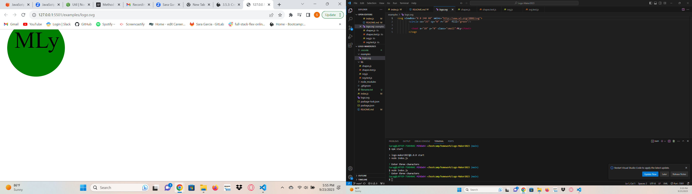

# Logo-Maker2023

## Description
This app is a simple way to create a logo. If it works. Mine worked for a few day, I added some code and then who knows what happened. It would be a great little app to help with designing a logo for your team,company, or family to match on vacation. If you could get all your family members to participate.

## Installation
All the extentions have been downloaded for this app already. All you need to do is type node index.js and the program should work.

## Usage
In the command prompt type node index.js and the program will start to run. It should ask you a series of questions about the shape, color, 3 letters you would like to use and the color of the font. Then a logo will generate for you. 

https://drive.google.com/file/d/1XVQ1Dt6VnqSncW6E6Go3zEZ9NSwqsPuL/view

git@github.com:Saragar710/Logo-Maker2023.git           I never know which one to add here. 
https://github.com/Saragar710/Logo-Maker2023.git

## Credits
I did work with a tutor.

## License
See github repo for more information.